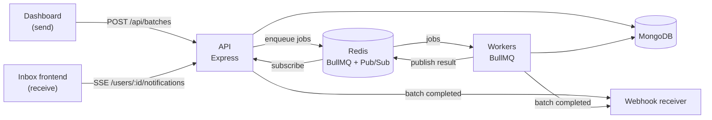

# Notification Pub/Sub System

[](https://github.com/ISOGrid-by-SkyVault/notification-pub-sub-system/actions/workflows/ci.yml)

An [ISOGrid](https://isogrid.skyvault.pro) example: a course-enrollment notification service built on a job queue, Redis Pub/Sub and Server-Sent Events.

You send a batch of notifications from a dashboard, workers dispatch them in the background, and each recipient sees theirs arrive live in an inbox page. When the whole batch is finished, a webhook fires exactly once.

It is a small system, but it has the moving parts of a real one: an API, replicated workers, a queue, a database, a webhook consumer and a frontend, each in its own container.

## Architecture



| Service    | What it does                                                        | Port | Dockerfile                                |
| ---------- | ------------------------------------------------------------------- | ---- | ----------------------------------------- |
| `api`      | REST API, SSE endpoint, serves the sender dashboard                 | 3000 | `Infrastructure/api.prod.Dockerfile`      |
| `worker`   | Consumes the queue, dispatches notifications, publishes the results | none | `Infrastructure/worker.prod.Dockerfile`   |
| `webhook`  | Example consumer of the batch-completion webhook                    | 3010 | `Infrastructure/webhook.prod.Dockerfile`  |
| `frontend` | Inbox page (nginx), proxies `/api` and the SSE stream to `api`      | 8080 | `frontend/Dockerfile`                     |
| `mongodb`  | Users, batches, notifications                                       | 27017 | `mongo:6-jammy`                          |
| `redis`    | BullMQ queue and Pub/Sub channels                                   | 6379 | `redis:7-alpine`                          |

### How a notification travels

1. The dashboard posts a batch to `POST /api/batches`. The API stores the batch, creates one notification per recipient and enqueues one BullMQ job per notification.
2. A worker picks up each job and simulates an unreliable dispatch. A failed attempt is retried with exponential backoff. After `DISPATCH_MAX_RETRIES` attempts the notification is marked `dead`.
3. On success, the worker publishes the result on the recipient's Redis channel, `user:<userId>:notifications`.
4. The API instance holding that user's SSE connection relays the event to the browser and only then marks the notification `delivered` in MongoDB.
5. If the user is not connected, the notification stays `pending`. It is replayed as soon as they open their inbox.
6. When every notification of a batch is `delivered` or `dead`, the batch becomes `completed` and the summary is posted to `WEBHOOK_URI`.

## Deploy on ISOGrid

ISOGrid reads the Dockerfiles, `docker-compose.yml` and `docker-swarm-stack.yml` in this repository, so there is nothing to configure before deploying.

1. Fork this repository, or use it directly.
2. In ISOGrid, connect your GitHub account and pick the repository and branch. See [Git repositories](https://docs.isogrid.skyvault.pro/guide/git-repositories).
3. Deploy. See [Deploying an application](https://docs.isogrid.skyvault.pro/guide/deploying-an-application) and the [first deployment tutorial](https://docs.isogrid.skyvault.pro/tutorials/first-deployment).

Two services are meant to be opened in a browser:

- `frontend` (port 8080) is the inbox, where notifications are received.
- `api` (port 3000) serves the dashboard, where they are sent.

Each published application gets an address on the platform. See [Addresses and domains](https://docs.isogrid.skyvault.pro/guide/addresses-and-domains).

`docker-compose.yml` needs no `.env` file: every variable has a default. The ones worth changing are listed under [Configuration](#configuration), and the credentials to store as secrets under [Secrets](#secrets). If the API is not reachable as `api` on the internal network, set `API_UPSTREAM` on the `frontend` service to its internal address.

## Run it locally

You need Docker with Compose.

```bash
git clone https://github.com/ISOGrid-by-SkyVault/notification-pub-sub-system.git
cd notification-pub-sub-system
docker compose up --build
```

Then open:

- Inbox: http://localhost:8080
- Dashboard: http://localhost:3000

If one of those ports is taken, choose others:

```bash
API_HOST_PORT=3900 FRONTEND_HOST_PORT=8980 docker compose up --build
```

### Try it

1. Open the inbox and pick a user (Alice, Bob or Carol). The badge turns to **Live**.
2. Open the dashboard in another tab and press **Publish Enrollment Batch**.
3. The notification appears in the inbox. About 30% of dispatch attempts fail on purpose, so some arrive after a retry and a few end up as **Failed**.
4. Switch to another user in the inbox. Their notification was waiting for them and arrives on connect.
5. Check the webhook: `docker compose logs webhook` shows the batch summary.

The API keeps one stream per user. If you listen to the same user in both the dashboard and the inbox, the newer page takes the stream and the older one stops listening.

### Development mode

`docker-compose.dev.yml` mounts the source and restarts the Node services on change:

```bash
cp .env.example .env
docker compose -f docker-compose.dev.yml up --build
```

It also publishes MongoDB (27017) and Redis (6379) on the host.

## API

| Method | Path                                  | Description                                    |
| ------ | ------------------------------------- | ---------------------------------------------- |
| GET    | `/health`                             | MongoDB and Redis status                       |
| GET    | `/api/users`                          | Seeded users                                   |
| POST   | `/api/batches`                        | Create a batch and enqueue its notifications   |
| GET    | `/api/batches?page=1&limit=10`        | List batches                                   |
| GET    | `/api/batches/:batchId`               | Batch status and counters                      |
| GET    | `/api/batches/:batchId/notifications` | Result per recipient                           |
| GET    | `/users/:userId/notifications`        | Server-Sent Events stream for one user         |

Create a batch:

```bash
curl -X POST http://localhost:3000/api/batches \
  -H "Content-Type: application/json" \
  -d '{
    "courseName": "Introduction to Cybersecurity",
    "message": "You have been enrolled. Your course starts on May 1st.",
    "priority": "high",
    "recipients": ["alice@example.com", "bob@example.com"]
  }'
```

Listen to a user's stream:

```bash
curl -N http://localhost:3000/users/u-00000000-0000-0000-0000-000000000001/notifications
```

Events on the stream are JSON objects, one per `data:` line:

| `type`         | Meaning                                                                                  |
| -------------- | ---------------------------------------------------------------------------------------- |
| `connected`    | The stream is ready.                                                                     |
| `notification` | One dispatch result: `notificationId`, `batchId`, `status` (`delivered` or `dead`), `recipient`, `attempts`, `dispatchedAt`, and `courseName`, `message`, `error` when available. |
| `stale`        | Another client opened this user's stream. The connection closes; do not reconnect.       |

The webhook receives:

```json
{
  "batchId": "1f96f383-214c-406f-8837-fb890b8f95cd",
  "summary": { "total": 2, "delivered": 2, "dead": 0 },
  "completedAt": "2026-01-01T12:00:00.000Z"
}
```

A [Bruno](https://www.usebruno.com) collection with these requests is in `bruno/`.

### Seeded users

| Name           | Email               | User ID                                  |
| -------------- | ------------------- | ---------------------------------------- |
| Alice Johnson  | `alice@example.com` | `u-00000000-0000-0000-0000-000000000001` |
| Bob Smith      | `bob@example.com`   | `u-00000000-0000-0000-0000-000000000002` |
| Carol Williams | `carol@example.com` | `u-00000000-0000-0000-0000-000000000003` |

A recipient email that matches no user is still dispatched. It has no stream to be confirmed on, so it is marked `delivered` as soon as the dispatch succeeds.

## Configuration

| Variable                | Default                                        | Used by       | Description                                             |
| ----------------------- | ---------------------------------------------- | ------------- | ------------------------------------------------------- |
| `PORT`                  | `3000` (api), `3010` (webhook)                 | api, webhook  | HTTP port                                               |
| `MONGODB_URI`           | `mongodb://mongodb:27017/notification_service` | api, worker   | MongoDB connection string                               |
| `REDIS_HOST`            | `redis`                                        | api, worker   | Redis host                                              |
| `REDIS_PORT`            | `6379`                                         | api, worker   | Redis port                                              |
| `REDIS_PASSWORD`        | empty                                          | api, worker, redis | Redis password. Secret.                            |
| `REDIS_MAX_RETRIES`     | `10`                                           | api, worker   | Retries per Redis request on the queue connection       |
| `DISPATCH_FAILURE_RATE` | `0.3`                                          | worker        | Probability (0 to 1) that one dispatch attempt fails    |
| `DISPATCH_MAX_RETRIES`  | `3`                                            | api, worker   | Attempts before a notification is marked `dead`         |
| `WEBHOOK_URI`           | `http://webhook:3010/webhook`                  | api, worker   | Where the batch-completion webhook is posted            |
| `MONGO_ROOT_USERNAME`   | empty                                          | mongodb       | MongoDB root user. Secret.                              |
| `MONGO_ROOT_PASSWORD`   | empty                                          | mongodb       | MongoDB root password. Secret.                          |
| `API_UPSTREAM`          | `http://api:3000`                              | frontend      | API address that nginx proxies to                       |
| `API_HOST_PORT`         | `3000`                                         | compose only  | Host port for the API                                   |
| `FRONTEND_HOST_PORT`    | `8080`                                         | compose only  | Host port for the inbox                                 |

Set `DISPATCH_FAILURE_RATE=0` to make every dispatch succeed, or `1` to watch every notification die after its retries.

### Secrets

Three values are credentials: `REDIS_PASSWORD`, `MONGO_ROOT_PASSWORD` (with `MONGO_ROOT_USERNAME`) and `MONGODB_URI`, because the connection string carries the MongoDB password.

Out of the box they are empty and MongoDB and Redis run without authentication. Neither is published outside the internal network, so this is fine for a first run. For anything longer-lived, set them:

| Variable              | Example value                                                                      |
| --------------------- | ---------------------------------------------------------------------------------- |
| `REDIS_PASSWORD`      | a long random string                                                               |
| `MONGO_ROOT_USERNAME` | `notifications`                                                                    |
| `MONGO_ROOT_PASSWORD` | a long random string                                                               |
| `MONGODB_URI`         | `mongodb://notifications:<password>@mongodb:27017/notification_service?authSource=admin` |

Once set, Redis and MongoDB refuse unauthenticated connections. MongoDB only creates the root user the first time it starts on an empty volume, so set the credentials before the first deployment.

How they reach the containers depends on where you deploy:

- **ISOGrid**: store them as secrets on the application. A secret is write-only: the running container receives it and nobody can read it back. See [Deploying an application](https://docs.isogrid.skyvault.pro/guide/deploying-an-application).
- **Docker Compose**: export them in your shell or put them in a local `.env` file, which is gitignored.
- **Docker Swarm**: the stack file uses Docker secrets, mounted as files under `/run/secrets`.
- **Kubernetes**: the manifest reads them from a `Secret`.

The application accepts each credential either as a variable (`REDIS_PASSWORD`, `MONGODB_URI`) or as a path to a file holding it (`REDIS_PASSWORD_FILE`, `MONGODB_URI_FILE`). Credentials are never written to the logs, and none are stored in the repository or in the images.

A secret protects the value at rest and from people browsing the platform. The application process itself still has to read it, so anyone who can run code inside the container can read it too.

## Other ways to deploy

### Docker Swarm

`docker-swarm-stack.yml` runs 2 API replicas and 3 workers with rolling updates. Credentials are Docker secrets, and a stack cannot build images, so create the secrets and build first:

```bash
MONGO_PW=$(openssl rand -hex 24)
printf '%s' "$MONGO_PW" | docker secret create mongo_root_password -
printf 'mongodb://notifications:%s@mongodb:27017/notification_service?authSource=admin' "$MONGO_PW" \n  | docker secret create mongodb_uri -
printf '%s' "$(openssl rand -hex 24)" | docker secret create redis_password -

docker compose build
docker stack deploy -c docker-swarm-stack.yml notifications
```

On a multi-node swarm, push the four images to a registry and prefix the image names in the stack file.

### Kubernetes

`k8s/manifest.yaml` creates a `notifications` namespace with everything in it: StatefulSets for MongoDB and Redis, Deployments for the API (2 replicas), workers (3), webhook receiver and frontend, their Services, an Ingress, and a `Secret` holding the credentials.

The `Secret` ships with `change-me` placeholders. Replace them before applying, or remove the block and create the Secret with `kubectl create secret` (the command is in the manifest).

The manifest uses the image names produced by `docker compose build`. Push them to your registry and replace the four `image:` values, or load them into a local cluster (`kind load docker-image`, `minikube image load`).

```bash
kubectl apply -f k8s/manifest.yaml
kubectl -n notifications get pods

kubectl -n notifications port-forward svc/frontend 8080:8080   # inbox
kubectl -n notifications port-forward svc/api 3000:3000        # dashboard
```

The Ingress uses two placeholder hosts, `inbox.example.com` and `dashboard.example.com`. Replace them with your own, or delete the Ingress and keep using port-forward.

## Project structure

```
.
├── src/
│   ├── api-server.ts         API entry point: routes and the SSE endpoint
│   ├── worker.ts             Worker entry point: job processor
│   ├── webhook-receiver.ts   Webhook receiver entry point
│   ├── config/               Environment, MongoDB connection and seed, queue
│   ├── controllers/          HTTP layer: validate the request, pick the status code
│   ├── managers/             Business flow
│   ├── gateways/             Database access (all Mongoose queries)
│   ├── views/                Response shaping
│   ├── models/               Mongoose schemas
│   ├── utils/                Zod schemas, batch completion and webhook
│   └── tests/                Unit tests
├── client/                   Sender dashboard, served by the API
├── frontend/                 Inbox page, nginx config and Dockerfile
├── Infrastructure/           Dockerfiles for api, worker and webhook (dev and prod)
├── k8s/manifest.yaml         Kubernetes manifest
├── bruno/                    API request collection
├── .github/workflows/ci.yml  Tests, image builds and compose validation
├── docker-compose.yml        Production images, all services
├── docker-compose.dev.yml    Hot-reload development setup
└── docker-swarm-stack.yml    Docker Swarm stack
```

## Design notes

**Layers.** A request goes through Controller, Manager, Gateway and View. Controllers handle HTTP, managers hold the business flow, the gateway is the only code that queries MongoDB, and views shape the JSON so internal fields never leak. Each layer can be tested with the one below it mocked.

**Pub/Sub between workers and API.** Workers do not know which API replica holds a user's connection, and they do not need to. They publish to the user's Redis channel, and whichever replica has the stream receives the message. Each SSE connection uses its own Redis subscriber, which is closed when the browser disconnects. A heartbeat comment every 15 seconds keeps proxies from dropping idle connections.

**Delivery is confirmed at the edge.** A successful dispatch leaves the notification `pending`. It becomes `delivered` only once the API has written it to an open stream. Anything dispatched while the user was away is found by a query on connect and replayed.

**Exactly-once webhook.** Several workers and API replicas can notice at the same moment that a batch is finished. The transition to `completed` is a single conditional update, `findOneAndUpdate({ batchId, status: { $ne: "completed" } }, ...)`. MongoDB lets one caller win; only that caller sends the webhook.

**Limits of the example.** There is no authentication: anyone who can reach the API can send batches and read any user's stream. The dispatch itself is simulated. Add both before using this as more than a starting point.

## Tests

The tests need Node.js 24 or later and a Redis reachable on `localhost:6379`:

```bash
docker run -d --rm -p 6379:6379 redis:7-alpine
npm install
npm test
```

GitHub Actions runs the same tests on every push and pull request, builds the four images and validates the compose and stack files (`.github/workflows/ci.yml`).

## License

[MIT](LICENSE)

## Learn more

- [ISOGrid documentation](https://docs.isogrid.skyvault.pro/)
- [ISOGrid](https://isogrid.skyvault.pro)
